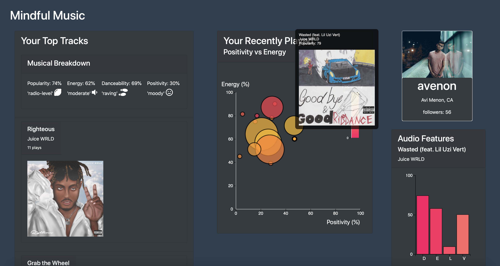

# Mindful-Music
Insights about what I listen to on a daily basis


## Configuration
Create a .env file in the Mindful-Music root directory
```bash
CLIENT_ID=<your_spotify_client_id>
CLIENT_SECRET=<your_spotify_secret_id>
```

## Installation 
Access http://localhost:8888

```bash
git clone https://github.com/avilegit/Mindful-Music.git
npm install
npm start
```

## Tests 
```bash
npm run test
```

## Contributing
Pull requests are welcome. For major changes, please open an issue first to discuss what you would like to change.

Please make sure to update tests as appropriate!
